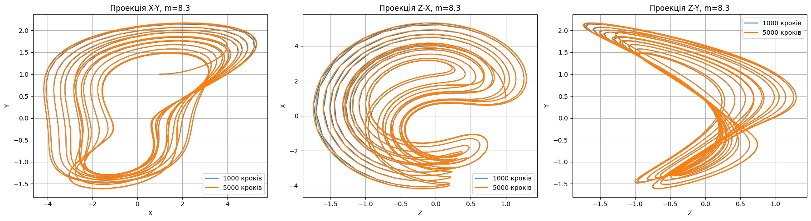
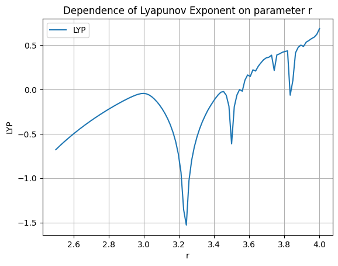
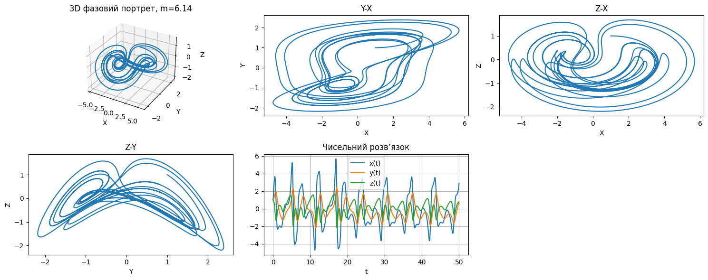

## Dynamical Systems Modeling & Analysis

Population Dynamics Analysis (Predator-Prey Models) – Simulated and analyzed predator-prey interactions using Python (NumPy, SciPy, Matplotlib, ipywidgets). Built interactive models to explore how population growth, predation efficiency, and natural mortality affect dynamics. Visualized time series, phase portraits, and equilibrium points. Found stable and unstable equilibria, observed spiral attractors, and studied parameter impacts on system behavior.
[Click here to view(part 1) the notebook in google colab for better experience and interactive details](https://colab.research.google.com/drive/1zGNvEDLc5uB18-GbSSGMzWbzfFNmVCqZ?usp=sharing)

Analyzed and visualized predator-prey and competitive population models (Lotka–Volterra and generalized models) using Python (`numpy`, `matplotlib`, `scipy`, `ipywidgets`). Built interactive simulations to explore time dynamics and phase portraits, identified equilibrium points, computed Jacobians, and classified stability types using eigenvalues. Key insights include the location and type of fixed points, effects of parameter changes on system behavior, and emergent population patterns. Interactive sliders allowed dynamic exploration of model parameters, providing intuition on stability and bifurcation phenomena.
[Click here to view(part 2) the notebook in google colab for better experience and interactive details](https://colab.research.google.com/drive/12jpklbBr5a8l72eVf5E56SLXatEkxsLW)

---
## Lorenz system analysis
Analyzed and visualized the Lorenz system using Python (numpy, scipy, matplotlib, sympy, ipywidgets). Computed numerical solutions for multiple parameter values and iteration steps, plotted 3D phase portraits and projections, identified equilibrium points, calculated Jacobians, and classified stability types using eigenvalues. Explored sensitivity to initial conditions, critical parameter values for the emergence of the Lorenz attractor, and dynamic transitions with interactive sliders. Key insights include chaotic behavior onset, unstable saddle points, divergence of trajectories from small perturbations, and the role of control parameters in system dynamics.
[Click here to view(part 1) the notebook in google colab for better experience and interactive details](https://colab.research.google.com/drive/1tpYBZY4_R1ueClDJNLQXwET1WClQdg53?usp=sharing)

[Click here to view(part 2) the notebook in google colab for better experience and interactive details](https://colab.research.google.com/drive/1Soh9I28VSajroiwIDpmNUpHLycJm52H5?usp=sharing)

##### (how beautifull math)

---

## Lyapunov logistic analysis
Analyzed and visualized discrete dynamical systems (logistic map and cosine map) using Python (numpy, matplotlib). Implemented trajectory simulations for different initial conditions and parameters to explore system behavior, constructed phase portraits, and investigated sensitivity to initial conditions. Calculated Lyapunov exponents to identify chaotic and stable regions, computed predictability horizons, and visualized how system stability varies with control parameters. Key insights include emergence of chaos for high parameter values, divergence of trajectories for close initial states, and parameter thresholds separating stable and chaotic dynamics.
[Click here to view(part 1) the notebook in google colab for better experience and interactive details](https://colab.research.google.com/drive/1ah4HySSUzZUPl6QCyNoRl7pZiyg9Q5W6?usp=sharing)

#### (chaose identifying)

Analyzed and simulated a 3D nonlinear dynamical system using Python (numpy, scipy, matplotlib). Implemented trajectory computations, phase portraits, and 3D projections to visualize system dynamics. Applied Benettin’s algorithm to calculate the largest Lyapunov exponent, exploring sensitivity to initial conditions and identifying chaotic behavior. Computed the Lyapunov spectrum and divergence to characterize stability and contraction/expansion directions. Key insights include the presence of a weakly chaotic regime, a positive Lyapunov exponent indicating chaos, a neutral direction, and a contracting direction. Interactive exploration allowed parameter variations to study effects on stability and chaos.

#### (dependency by parameter)

[Click here to view(part 2) the notebook in google colab for better experience and interactive details](https://colab.research.google.com/drive/11GPDmLt3XeNlIoqxxBYaQsIa0QaAusf7?usp=sharing)