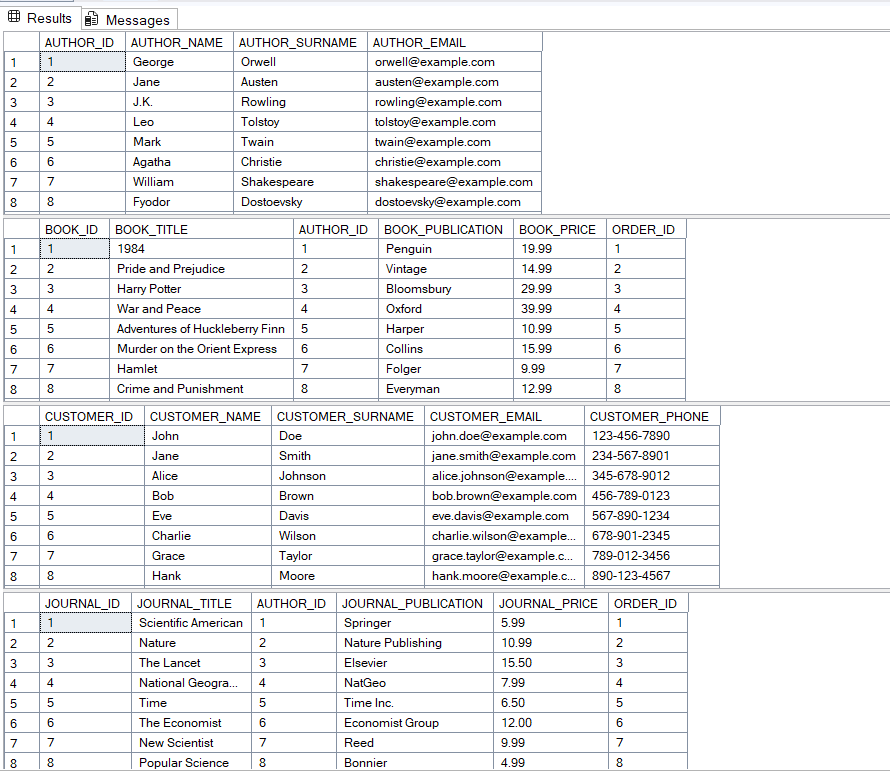
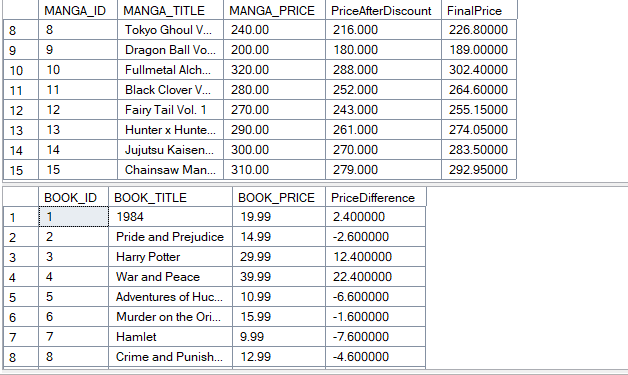
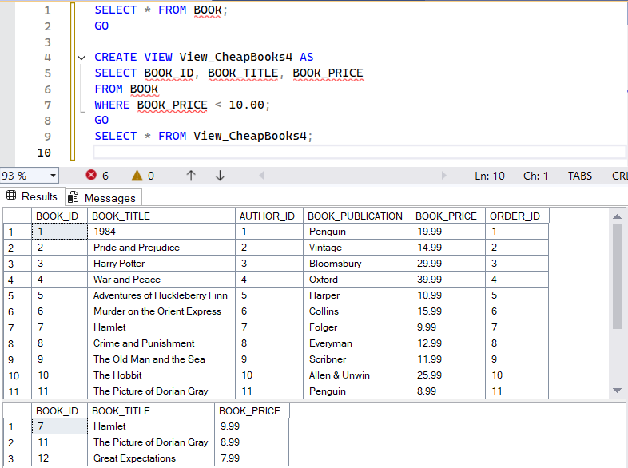
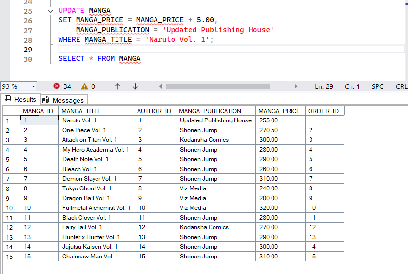
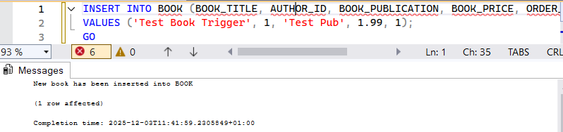
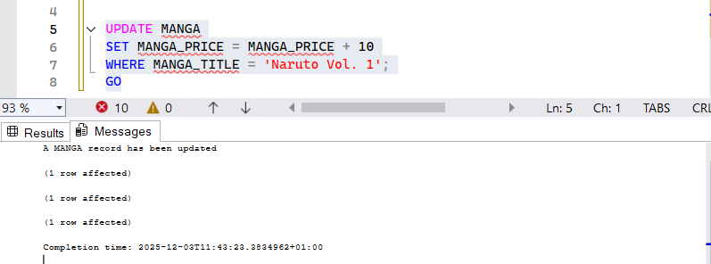
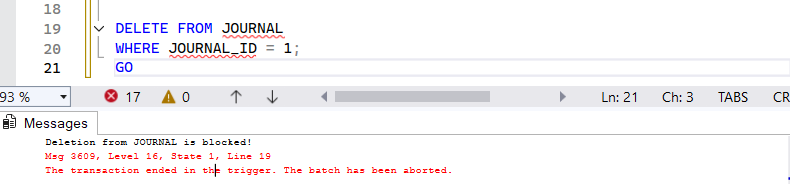

Database in my project represents a bookstore system
[Click here to check query](creation_of_main_structure_functionality_dependencies.sql)
## Main Entities
CUSTOMER — stores customer personal info (name, surname, phone, email).
AUTHOR — contains author identification and contact details.
BOOK — list of books linked to authors and orders.
JOURNAL — scientific/popular journals linked to authors and orders.
MANGA — manga titles with pricing and publishing details.
ORDER_TYPE — represents orders placed by customers (dates + total amount).
ORDER_EXEC — records actual execution of orders (final date + paid amount).

## Core Relationships
One AUTHOR → multiple BOOK / JOURNAL / MANGA.
One CUSTOMER → multiple ORDER_TYPE.
One ORDER_TYPE → one ORDER_EXEC (execution record).
BOOK / JOURNAL / MANGA reference ORDER_ID (what was purchased).
## Database Purpose
This database enables:
Storing bookshop inventory across various media types.
Tracking customers and their orders.
Logging order processing and execution.
Connecting literature types with their authors.
---
[Click here to check query](joins_aggregations_view.sql)
Returns all books with price < 17.
Shows book title, author, and price in this range.
Filters manga titles starting with these letters.
All journals ordered from highest to lowest price.
Shows all orders, even without a book.
Only orders that have execution info.
Shows all books, even if not in an order.
Full combination of both tables (225 rows).
Counts how many orders each customer made.
Aggregated average price.
Most expensive book by each author.
Discount and final price with tax.

Shows if a book is cheaper/more expensive than average.
View with all books priced < 10.

---
[Click here to check query](library_db_queries_editing_changing_col.sql)
## Insert Authors & Books
- Added authors (e.g., John Doe) to `AUTHOR`.
- Added books linked to authors in `BOOK`.

## Delete & Truncate
- Delete first two execution orders:
`DELETE FROM ORDER_EXEC`
`WHERE ORDER_ID IN (SELECT TOP (2) ORDER_ID FROM `
`ORDER_EXEC ORDER BY ORDER_EXEC_ID);`

## Update exect column with rising a prise

---
# Database Triggers Summary

[Click here to check query](triggers_adding.sql)
## 1. Book Insert Trigger
**Trigger:** `trg_book_insert`  
**Action:** Fires AFTER inserting a book.  
**Message:** `"New book has been inserted into BOOK"`  

## 2. Author Insert Block
**Trigger:** `trg_author_no_insert`  
**Action:** Prevents INSERT into `AUTHOR`.  
**Message:** `"Insertion into AUTHOR is blocked!"`
*Note: due to restriction during creation its not allowed to use this trigger, cause author can note be null*
**Msg 515, Level 16, State 2, Line 12**
**Cannot insert the value NULL into column 'ORDER_ID', table**
**'bookshop_project.dbo.BOOK'; column does not allow nulls. INSERT fails.**
**The statement has been terminated.**  

## 3. Manga Update Trigger
**Trigger:** `trg_manga_update`  
**Action:** Fires AFTER updating a manga.  
**Message:** `"A MANGA record has been updated"`  
**Output:** Shows `INSERTED` and `DELETED` rows.  

## 4. Order Execution Update Block
**Trigger:** `trg_customer_no_update`  
**Action:** Prevents UPDATE on `ORDER_EXEC`.  
**Message:** `"Updating ORDER_EXEC is blocked!"`  

## 5. Cascade Delete on Order_EXEC
**Foreign Key:** `FR_ORDER_EXEC_ORDER`  
**Action:** Deleting an `ORDER_TYPE` record deletes related `ORDER_EXEC` rows automatically. 
Note: dependency exiest

## 6. Order Execution Delete Trigger
**Trigger:** `trg_delete_orderExec`  
**Action:** Fires AFTER DELETE on `ORDER_EXEC`.  
**Output:** Prints deleted `ORDER_EXEC_ID` with timestamp.  

## 7. Journal Delete Block
**Trigger:** `trg_Journal_Prevent_Delete`  
**Action:** Prevents DELETE on `JOURNAL`.  
**Message:** `"Deletion from JOURNAL is blocked!"`  

